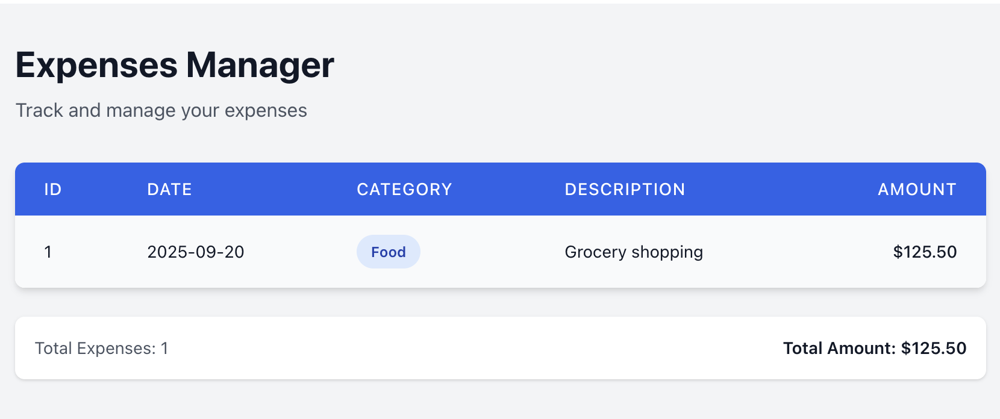

# React - Complete Development Guide

A comprehensive guide covering React fundamentals through advanced patterns, hooks, routing, state management, and modern development practices.

## Table of Contents

- [Getting Started](#getting-started)
- [Core Concepts](#core-concepts)
- [Component Patterns](#component-patterns)
- [Hooks Deep Dive](#hooks-deep-dive)
- [Routing & Navigation](#routing--navigation)
- [State Management](#state-management)
- [Styling Solutions](#styling-solutions)
- [Performance Optimization](#performance-optimization)
- [Advanced Patterns](#advanced-patterns)
- [Testing](#testing)
- [Production & Deployment](#production--deployment)

---

## Getting Started

### Environment Setup

#### Create a New React Application

```bash
# Using Vite (Recommended)
npm create vite@latest my-react-app -- --template react-ts
cd my-react-app
npm install
npm run dev

# Alternative: Create React App
npx create-react-app my-app --template typescript
cd my-app
npm start
```

#### Essential Dependencies

```bash
# Core routing
npm install react-router-dom

# State management
npm install @reduxjs/toolkit react-redux

# Styling
npm install styled-components
npm install @emotion/react @emotion/styled

# UI Framework
npm install @mui/material @mui/icons-material

# HTTP client
npm install axios

# Form handling
npm install react-hook-form

# Validation
npm install zod
```

### First React Component

```tsx
// App.tsx
import React from "react";

function App(): JSX.Element {
  const appName = "My React App";

  return (
    <div className="app">
      <h1>Welcome to {appName}!</h1>
      <p>Your journey with React begins here.</p>
    </div>
  );
}

export default App;
```

#### Exercise: Personal Profile Component

Create a component that displays:

- Full name
- Email address
- Location
- Brief bio
- Profile image

---

## Core Concepts

### JSX (JavaScript XML)

JSX allows you to write HTML-like syntax in JavaScript, providing a declarative way to describe UI.

#### Key JSX Rules:

1. Must return a single parent element or Fragment
2. Use `className` instead of `class`
3. All tags must be closed
4. Use camelCase for event handlers

```tsx
// Good JSX practices
function UserProfile({ user }: { user: User }) {
  return (
    <div className="user-profile">
      
      <h2>{user.name}</h2>
      <p>{user.bio}</p>
      {user.isOnline && <span className="online-indicator">Online</span>}
    </div>
  );
}
```

### Components Architecture

#### Functional Components (Recommended)

```tsx
interface TaskProps {
  title: string;
  createdAt: Date;
  domain: "development" | "documentation" | "design";
  isCompleted?: boolean;
  onToggle?: () => void;
}

const DeveloperTask: React.FC<TaskProps> = ({
  title,
  createdAt,
  domain,
  isCompleted = false,
  onToggle,
}) => {
  return (
    <article className={`task ${isCompleted ? "completed" : ""}`}>
      <h1>{title}</h1>
      <h3>Created: {createdAt.toLocaleDateString()}</h3>
      <span className={`domain domain--${domain}`}>{domain}</span>
      {onToggle && (
        <button onClick={onToggle}>
          {isCompleted ? "Mark Incomplete" : "Mark Complete"}
        </button>
      )}
    </article>
  );
};
```

#### Exercise: Task Management

Create a `TaskList` component that:

1. Displays multiple `DeveloperTask` components
2. Allows toggling task completion status
3. Filters tasks by domain
4. Shows task statistics

### Props and Component Composition

Props enable data flow from parent to child components, creating reusable and flexible components.

```tsx
// Parent Component
function TaskDashboard() {
  const tasks = [
    {
      id: 1,
      title: "Implement user authentication",
      createdAt: new Date("2024-01-15"),
      domain: "development" as const,
      isCompleted: false,
    },
    {
      id: 2,
      title: "Write API documentation",
      createdAt: new Date("2024-01-16"),
      domain: "documentation" as const,
      isCompleted: true,
    },
  ];

  return (
    <div className="dashboard">
      <h1>Task Dashboard</h1>
      {tasks.map((task) => (
        <DeveloperTask
          key={task.id}
          title={task.title}
          createdAt={task.createdAt}
          domain={task.domain}
          isCompleted={task.isCompleted}
        />
      ))}
    </div>
  );
}
```

---

## Component Patterns

### State Management with useState

```tsx
import React, { useState } from "react";

interface CounterProps {
  initialValue?: number;
  step?: number;
}

const Counter: React.FC<CounterProps> = ({ initialValue = 0, step = 1 }) => {
  const [count, setCount] = useState(initialValue);

  const increment = () => setCount((prev) => prev + step);
  const decrement = () => setCount((prev) => prev - step);
  const reset = () => setCount(initialValue);

  return (
    <div className="counter">
      <h2>Count: {count}</h2>
      <div className="counter-controls">
        <button onClick={decrement}>-{step}</button>
        <button onClick={reset}>Reset</button>
        <button onClick={increment}>+{step}</button>
      </div>
    </div>
  );
};
```

### Event Handling

```tsx
function InteractiveButton() {
  const [clickCount, setClickCount] = useState(0);
  const [isPressed, setIsPressed] = useState(false);

  const handleClick = (event: React.MouseEvent<HTMLButtonElement>) => {
    console.log("Button clicked!", event);
    setClickCount((prev) => prev + 1);
  };

  const handleMouseDown = () => setIsPressed(true);
  const handleMouseUp = () => setIsPressed(false);

  return (
    <button
      onClick={handleClick}
      onMouseDown={handleMouseDown}
      onMouseUp={handleMouseUp}
      className={`interactive-btn ${isPressed ? "pressed" : ""}`}
    >
      Clicked {clickCount} times
    </button>
  );
}
```

### Conditional Rendering

```tsx
interface AuthStatusProps {
  user?: { name: string; role: string } | null;
  isLoading?: boolean;
}

const AuthStatus: React.FC<AuthStatusProps> = ({ user, isLoading }) => {
  if (isLoading) {
    return <div className="loading">Checking authentication...</div>;
  }

  return (
    <div className="auth-status">
      {user ? (
        <div className="user-info">
          <span>Welcome back, {user.name}!</span>
          <span className="role">{user.role}</span>
          <button className="logout-btn">Logout</button>
        </div>
      ) : (
        <div className="guest-actions">
          <button className="login-btn">Sign In</button>
          <button className="register-btn">Register</button>
        </div>
      )}
    </div>
  );
};
```

### Lists and Keys

```tsx
interface Movie {
  id: number;
  title: string;
  year: number;
  genre: string;
  rating: number;
}

const MovieList: React.FC<{ movies: Movie[] }> = ({ movies }) => {
  return (
    <div className="movie-list">
      <h2>Favorite Movies</h2>
      {movies.length === 0 ? (
        <p>No movies in your list yet.</p>
      ) : (
        <ul>
          {movies.map((movie) => (
            <li key={movie.id} className="movie-item">
              <div className="movie-info">
                <h3>{movie.title}</h3>
                <span className="year">({movie.year})</span>
              </div>
              <div className="movie-meta">
                <span className="genre">{movie.genre}</span>
                <span className="rating">⭐ {movie.rating}/10</span>
              </div>
            </li>
          ))}
        </ul>
      )}
    </div>
  );
};

// Exercise: Add sorting, filtering, and search functionality
```

### Form Handling

```tsx
import React, { useState, FormEvent } from "react";

interface FormData {
  name: string;
  email: string;
  message: string;
}

const ContactForm: React.FC = () => {
  const [formData, setFormData] = useState<FormData>({
    name: "",
    email: "",
    message: "",
  });
  const [isSubmitting, setIsSubmitting] = useState(false);

  const handleInputChange = (
    event: React.ChangeEvent<HTMLInputElement | HTMLTextAreaElement>
  ) => {
    const { name, value } = event.target;
    setFormData((prev) => ({
      ...prev,
      [name]: value,
    }));
  };

  const handleSubmit = async (event: FormEvent<HTMLFormElement>) => {
    event.preventDefault();
    setIsSubmitting(true);

    try {
      // Simulate API call
      await new Promise((resolve) => setTimeout(resolve, 1000));
      console.log("Form submitted:", formData);

      // Reset form
      setFormData({ name: "", email: "", message: "" });
    } catch (error) {
      console.error("Submission failed:", error);
    } finally {
      setIsSubmitting(false);
    }
  };

  return (
    <form onSubmit={handleSubmit} className="contact-form">
      <div className="form-group">
        <label htmlFor="name">Name</label>
        <input
          type="text"
          id="name"
          name="name"
          value={formData.name}
          onChange={handleInputChange}
          required
        />
      </div>

      <div className="form-group">
        <label htmlFor="email">Email</label>
        <input
          type="email"
          id="email"
          name="email"
          value={formData.email}
          onChange={handleInputChange}
          required
        />
      </div>

      <div className="form-group">
        <label htmlFor="message">Message</label>
        <textarea
          id="message"
          name="message"
          value={formData.message}
          onChange={handleInputChange}
          rows={4}
          required
        />
      </div>

      <button type="submit" disabled={isSubmitting}>
        {isSubmitting ? "Submitting..." : "Submit"}
      </button>
    </form>
  );
};
```

---

## Hooks Deep Dive

### useEffect - Side Effects Management

```tsx
import React, { useState, useEffect } from "react";

interface User {
  id: number;
  name: string;
  email: string;
}

const UserProfile: React.FC<{ userId: number }> = ({ userId }) => {
  const [user, setUser] = useState<User | null>(null);
  const [loading, setLoading] = useState(true);
  const [error, setError] = useState<string | null>(null);

  useEffect(() => {
    let cancelled = false;

    const fetchUser = async () => {
      try {
        setLoading(true);
        setError(null);

        const response = await fetch(`/api/users/${userId}`);
        if (!response.ok) {
          throw new Error(`Failed to fetch user: ${response.status}`);
        }

        const userData = await response.json();

        if (!cancelled) {
          setUser(userData);
        }
      } catch (err) {
        if (!cancelled) {
          setError(err instanceof Error ? err.message : "Unknown error");
        }
      } finally {
        if (!cancelled) {
          setLoading(false);
        }
      }
    };

    fetchUser();

    // Cleanup function
    return () => {
      cancelled = true;
    };
  }, [userId]);

  if (loading) return <div>Loading user...</div>;
  if (error) return <div>Error: {error}</div>;
  if (!user) return <div>User not found</div>;

  return (
    <div className="user-profile">
      <h2>{user.name}</h2>
      <p>{user.email}</p>
    </div>
  );
};
```

#### useEffect Cleanup Example

```tsx
function WindowSize() {
  const [dimensions, setDimensions] = useState({
    width: window.innerWidth,
    height: window.innerHeight,
  });

  useEffect(() => {
    function handleResize() {
      setDimensions({
        width: window.innerWidth,
        height: window.innerHeight,
      });
    }

    window.addEventListener("resize", handleResize);

    // Cleanup function
    return () => {
      window.removeEventListener("resize", handleResize);
    };
  }, []); // Empty dependency array = runs once on mount

  return (
    <div>
      <p>Width: {dimensions.width}px</p>
      <p>Height: {dimensions.height}px</p>
    </div>
  );
}
```

### useMemo - Performance Optimization

```tsx
import React, { useState, useMemo } from "react";

interface Product {
  id: number;
  name: string;
  price: number;
  category: string;
}

const ProductAnalytics: React.FC<{ products: Product[] }> = ({ products }) => {
  const [sortBy, setSortBy] = useState<"name" | "price">("name");
  let user = {name::"gal"  } // change? recalculate memo. 
  // Expensive calculation memoized
  const analytics = useMemo(() => {
    console.log("Calculating analytics...");

    const avgPrice =
      products.reduce((sum, p) => sum + p.price, 0) / products.length;
    const maxPrice = Math.max(...products.map((p) => p.price));
    const minPrice = Math.min(...products.map((p) => p.price));

    const categoryCounts = products.reduce((acc, product) => {
      acc[product.category] = (acc[product.category] || 0) + 1;
      return acc;
    }, {} as Record<string, number>);

    return {
      avgPrice: avgPrice.toFixed(2),
      maxPrice,
      minPrice,
      totalProducts: products.length,
      categories: categoryCounts,
    };
  }, [products]); // Recalculates only when products change

  const sortedProducts = useMemo(() => {
    return [...products].sort((a, b) => {
      if (sortBy === "price") {
        return b.price - a.price;
      }
      return a.name.localeCompare(b.name);
    });
  }, [products, sortBy]);

  return (
    <div className="product-analytics">
      <div className="analytics-summary">
        <h3>Product Statistics</h3>
        <p>Total Products: {analytics.totalProducts}</p>
        <p>Average Price: ${analytics.avgPrice}</p>
        <p>
          Price Range: ${analytics.minPrice} - ${analytics.maxPrice}
        </p>
      </div>

      <div className="sort-controls">
        <button
          onClick={() => setSortBy("name")}
          className={sortBy === "name" ? "active" : ""}
        >
          Sort by Name
        </button>
        <button
          onClick={() => setSortBy("price")}
          className={sortBy === "price" ? "active" : ""}
        >
          Sort by Price
        </button>
      </div>

      <div className="product-list">
        {sortedProducts.map((product) => (
          <div key={product.id} className="product-item">
            <span>{product.name}</span>
            <span>${product.price}</span>
          </div>
        ))}
      </div>
    </div>
  );
};
```

### useCallback - Function Memoization

```tsx
import React, { useState, useCallback, memo } from "react";

// Memoized child component
const TaskItem = memo<{
  task: { id: number; title: string; completed: boolean };
  onToggle: (id: number) => void;
  onDelete: (id: number) => void;
}>(({ task, onToggle, onDelete }) => {
  console.log(`TaskItem ${task.id} rendered`);

  return (
    <div className="task-item">
      <span className={task.completed ? "completed" : ""}>{task.title}</span>
      <button onClick={() => onToggle(task.id)}>
        {task.completed ? "Undo" : "Complete"}
      </button>
      <button onClick={() => onDelete(task.id)}>Delete</button>
    </div>
  );
});

const TaskManager: React.FC = () => {
  const [tasks, setTasks] = useState([
    { id: 1, title: "Learn React", completed: false },
    { id: 2, title: "Build a project", completed: false },
  ]);

  // Memoized callbacks prevent unnecessary re-renders
  const handleToggleTask = useCallback((id: number) => {
    setTasks((prev) =>
      prev.map((task) =>
        task.id === id ? { ...task, completed: !task.completed } : task
      )
    );
  }, []);

  const handleDeleteTask = useCallback((id: number) => {
    setTasks((prev) => prev.filter((task) => task.id !== id));
  }, []);

  return (
    <div className="task-manager">
      {tasks.map((task) => (
        <TaskItem
          key={task.id}
          task={task}
          onToggle={handleToggleTask}
          onDelete={handleDeleteTask}
        />
      ))}
    </div>
  );
};
```

### useRef - DOM References and Mutable Values

```tsx
import React, { useRef, useEffect, useState } from "react";

const FocusableInput: React.FC = () => {
  const inputRef = useRef<HTMLInputElement>(null);
  const [count, setCount] = useState(0);
  const renderCount = useRef(0);

  // Focus input on mount
  useEffect(() => {
    inputRef.current?.focus();
  }, []);

  // Track render count without causing re-renders
  useEffect(() => {
    renderCount.current += 1;
  });

  const handleFocusInput = () => {
    inputRef.current?.focus();
  };

  return (
    <div>
      <p>Component rendered {renderCount.current} times</p>
      <input ref={inputRef} type="text" placeholder="I'm focused on mount!" />
      <button onClick={handleFocusInput}>Focus Input</button>
      <button onClick={() => setCount((c) => c + 1)}>Count: {count}</button>
    </div>
  );
};
```

### Custom Hooks

```tsx
// Custom hook for API calls
function useApi<T>(url: string) {
  const [data, setData] = useState<T | null>(null);
  const [loading, setLoading] = useState(true);
  const [error, setError] = useState<string | null>(null);

  useEffect(() => {
    let cancelled = false;

    const fetchData = async () => {
      try {
        setLoading(true);
        setError(null);

        const response = await fetch(url);
        if (!response.ok) {
          throw new Error(`HTTP error! status: ${response.status}`);
        }

        const result = await response.json();

        if (!cancelled) {
          setData(result);
        }
      } catch (err) {
        if (!cancelled) {
          setError(err instanceof Error ? err.message : "Unknown error");
        }
      } finally {
        if (!cancelled) {
          setLoading(false);
        }
      }
    };

    fetchData();

    return () => {
      cancelled = true;
    };
  }, [url]);

  return { data, loading, error };
}

// Custom hook for image loading
function useImageLoader(src: string, fallbackSrc: string) {
  const [imageSrc, setImageSrc] = useState<string>(fallbackSrc);
  const [isLoaded, setIsLoaded] = useState(false);
  const [hasError, setHasError] = useState(false);

  useEffect(() => {
    const img = new Image();

    img.onload = () => {
      setImageSrc(src);
      setIsLoaded(true);
      setHasError(false);
    };

    img.onerror = () => {
      setImageSrc(fallbackSrc);
      setIsLoaded(true);
      setHasError(true);
    };

    img.src = src;

    return () => {
      img.onload = null;
      img.onerror = null;
    };
  }, [src, fallbackSrc]);

  return { imageSrc, isLoaded, hasError };
}

// Usage example
const ImageComponent: React.FC<{ src: string; alt: string }> = ({
  src,
  alt,
}) => {
  const defaultImage = "https://via.placeholder.com/300x200?text=No+Image";
  const { imageSrc, isLoaded, hasError } = useImageLoader(src, defaultImage);

  return (
    <div className="image-container">
      {!isLoaded && <div className="image-placeholder">Loading...</div>}
      
      {hasError && <p className="error-text">Failed to load original image</p>}
    </div>
  );
};
```

---

## Routing & Navigation

### React Router Setup

```bash
npm install react-router-dom
```

```tsx
// App.tsx
import React, { Suspense, lazy } from "react";
import { BrowserRouter, Routes, Route, Navigate } from "react-router-dom";
import Navigation from "./components/Navigation";
import ErrorBoundary from "./components/ErrorBoundary";

// Lazy load components for code splitting
const Home = lazy(() => import("./pages/Home"));
const About = lazy(() => import("./pages/About"));
const Products = lazy(() => import("./pages/Products"));
const ProductDetail = lazy(() => import("./pages/ProductDetail"));
const Profile = lazy(() => import("./pages/Profile"));
const Login = lazy(() => import("./pages/Login"));
const NotFound = lazy(() => import("./pages/NotFound"));

const App: React.FC = () => {
  return (
    <BrowserRouter>
      <div className="app">
        <Navigation />
        <main className="main-content">
          <ErrorBoundary>
            <Suspense fallback={<div className="loading">Loading...</div>}>
              <Routes>
                {/* Public routes */}
                <Route path="/" element={<Home />} />
                <Route path="/about" element={<About />} />
                <Route path="/login" element={<Login />} />

                {/* Products routes */}
                <Route path="/products" element={<Products />} />
                <Route path="/products/:id" element={<ProductDetail />} />

                {/* Protected routes */}
                <Route
                  path="/profile"
                  element={
                    <ProtectedRoute>
                      <Profile />
                    </ProtectedRoute>
                  }
                />

                {/* Redirects */}
                <Route path="/home" element={<Navigate to="/" replace />} />

                {/* 404 */}
                <Route path="*" element={<NotFound />} />
              </Routes>
            </Suspense>
          </ErrorBoundary>
        </main>
      </div>
    </BrowserRouter>
  );
};
```

### Navigation Component

```tsx
import React from "react";
import { Link, NavLink, useLocation } from "react-router-dom";

const Navigation: React.FC = () => {
  const location = useLocation();

  return (
    <nav className="navigation">
      <div className="nav-brand">
        <Link to="/">MyApp</Link>
      </div>

      <ul className="nav-links">
        <li>
          <NavLink
            to="/"
            className={({ isActive }) => (isActive ? "active" : "")}
          >
            Home
          </NavLink>
        </li>
        <li>
          <NavLink
            to="/about"
            className={({ isActive }) => (isActive ? "active" : "")}
          >
            About
          </NavLink>
        </li>
        <li>
          <NavLink
            to="/products"
            className={({ isActive }) => (isActive ? "active" : "")}
          >
            Products
          </NavLink>
        </li>
      </ul>

      <div className="nav-actions">
        <span className="current-path">Path: {location.pathname}</span>
      </div>
    </nav>
  );
};
```

### Route Parameters and Navigation Hooks

```tsx
import React from "react";
import { useParams, useNavigate, useSearchParams } from "react-router-dom";

const ProductDetail: React.FC = () => {
  const { id } = useParams<{ id: string }>();
  const navigate = useNavigate();
  const [searchParams, setSearchParams] = useSearchParams();

  const view = searchParams.get("view") || "details";

  const handleBackToProducts = () => {
    navigate("/products", { replace: false });
  };

  const handleViewChange = (newView: string) => {
    setSearchParams({ view: newView });
  };

  return (
    <div className="product-detail">
      <button onClick={handleBackToProducts}>← Back to Products</button>

      <h1>Product {id}</h1>

      <div className="view-controls">
        <button
          onClick={() => handleViewChange("details")}
          className={view === "details" ? "active" : ""}
        >
          Details
        </button>
        <button
          onClick={() => handleViewChange("reviews")}
          className={view === "reviews" ? "active" : ""}
        >
          Reviews
        </button>
      </div>

      {view === "details" && <div>Product details content...</div>}
      {view === "reviews" && <div>Product reviews content...</div>}
    </div>
  );
};
```

### Protected Routes

```tsx
import React, { createContext, useContext, useState } from "react";
import { Navigate, useLocation } from "react-router-dom";

// Auth Context
interface AuthContextType {
  user: { name: string; role: string } | null;
  login: (username: string, password: string) => Promise<boolean>;
  logout: () => void;
  isAuthenticated: boolean;
}

const AuthContext = createContext<AuthContextType | null>(null);

export const useAuth = () => {
  const context = useContext(AuthContext);
  if (!context) {
    throw new Error("useAuth must be used within AuthProvider");
  }
  return context;
};

export const AuthProvider: React.FC<{ children: React.ReactNode }> = ({
  children,
}) => {
  const [user, setUser] = useState<{ name: string; role: string } | null>(null);

  const login = async (
    username: string,
    password: string
  ): Promise<boolean> => {
    // Simulate API call
    if (username === "admin" && password === "password") {
      setUser({ name: "Admin User", role: "admin" });
      return true;
    }
    return false;
  };

  const logout = () => {
    setUser(null);
  };

  return (
    <AuthContext.Provider
      value={{
        user,
        login,
        logout,
        isAuthenticated: !!user,
      }}
    >
      {children}
    </AuthContext.Provider>
  );
};

// Protected Route Component
const ProtectedRoute: React.FC<{ children: React.ReactNode }> = ({
  children,
}) => {
  const { isAuthenticated } = useAuth();
  const location = useLocation();

  if (!isAuthenticated) {
    return <Navigate to="/login" state={{ from: location }} replace />;
  }

  return <>{children}</>;
};
```

---

## State Management

### Context API with useReducer

```tsx
import React, { createContext, useContext, useReducer, ReactNode } from 'react';

// State types
interface AppState {
  theme: 'light' | 'dark';
  isUtcTime: boolean;
  user: { name: string; email: string } | null;
  notifications: Array<{ id: string; message: string; type: 'info' | 'error' | 'success' }>;
}

// Action types
type AppAction =
  | { type: 'SET_THEME'; payload: 'light' | 'dark' }
  | { type: 'TOGGLE_TIME_FORMAT' }
  | { type: 'SET_USER'; payload: { name: string; email: string } | null }
  | { type: 'ADD_NOTIFICATION'; payload: { message: string; type: 'info' | 'error' | 'success' } }
  | { type: 'REMOVE_NOTIFICATION'; payload: string };

// Initial state
const initialState: AppState = {
  theme: 'light',
  isUtcTime: false,
  user: null,
  notifications: []
};

// Reducer
function appReducer(state: AppState, action: AppAction): AppState {
  switch (action.type) {
    case 'SET_THEME':
      return { ...state, theme: action.payload };

    case 'TOGGLE_TIME_FORMAT':
      return { ...state, isUtcTime: !state.isUtcTime };

    case 'SET_USER':
      return { ...state, user: action.payload };

    case 'ADD_NOTIFICATION':
      return {
        ...state,
        notifications: [
          ...state.notifications,
          { id: Date.now().toString(), ...action.payload }
        ]
      };

    case 'REMOVE_NOTIFICATION':
      return {
        ...state,
        notifications: state.notifications.filter(n => n.id !== action.payload)
      };

    default:
      return state;
  }
}

// Context
const AppStateContext = createContext<{
  state: AppState;
  dispatch: React.Dispatch<AppAction>;
} | null>(null);

export const useAppState = () => {
  const context = useContext(AppStateContext);
  if (!context) {
    throw new Error('
```

### Exercise 1

1. Based on the following Data

```json
{
  "results": [
    {
      "gender": "male",
      "name": { "title": "Mr", "first": "Grayson", "last": "Jackson" },
      "location": {
        "street": { "number": 5343, "name": "Coronation Avenue" },
        "city": "Hamilton",
        "state": "Auckland",
        "country": "New Zealand",
        "postcode": 53379,
        "coordinates": { "latitude": "51.3765", "longitude": "-24.3521" },
        "timezone": { "offset": "+9:30", "description": "Adelaide, Darwin" }
      },
      "email": "grayson.jackson@example.com",
      "login": {
        "uuid": "64e82407-16ca-45b3-976d-55259904f41a",
        "username": "happyswan409",
        "password": "inter",
        "salt": "gzUQwTlh",
        "md5": "099c2cf74cd2867f3c40c2e25a1dbe60",
        "sha1": "00b9a1afbb1a597b7b966dde0cdec6e6e199d2a7",
        "sha256": "2fd498b4bedcde999bc1d55356d3ba35659aca4d5e6831c8d85c0dea6ed3ba17"
      },
      "dob": { "date": "1964-06-12T05:20:13.089Z", "age": 61 },
      "registered": { "date": "2004-11-27T03:22:51.740Z", "age": 20 },
      "phone": "(560)-292-0615",
      "cell": "(123)-028-1218",
      "id": { "name": "", "value": null },
      "picture": {
        "large": "https://randomuser.me/api/portraits/men/37.jpg",
        "medium": "https://randomuser.me/api/portraits/med/men/37.jpg",
        "thumbnail": "https://randomuser.me/api/portraits/thumb/men/37.jpg"
      },
      "nat": "NZ"
    },
    {
      "gender": "female",
      "name": { "title": "Ms", "first": "Latife", "last": "Çankaya" },
      "location": {
        "street": { "number": 1791, "name": "Abanoz Sk" },
        "city": "Rize",
        "state": "Rize",
        "country": "Turkey",
        "postcode": 67463,
        "coordinates": { "latitude": "-60.8474", "longitude": "6.2726" },
        "timezone": {
          "offset": "-3:00",
          "description": "Brazil, Buenos Aires, Georgetown"
        }
      },
      "email": "latife.cankaya@example.com",
      "login": {
        "uuid": "23503d24-2dee-494f-926a-aa563276f872",
        "username": "blackkoala774",
        "password": "hunter",
        "salt": "wznlEz0H",
        "md5": "0e10724684a5ac8036de811a3fa77b90",
        "sha1": "ba11e42d47ee2e445dd2a8796601f11420bd8d07",
        "sha256": "b8e454a42a116031447b7243328c7bf876c2436d86cd5f7a53728d996b09fe22"
      },
      "dob": { "date": "1947-02-07T02:21:10.587Z", "age": 78 },
      "registered": { "date": "2011-11-02T20:58:49.408Z", "age": 13 },
      "phone": "(516)-510-0292",
      "cell": "(182)-787-3776",
      "id": { "name": "", "value": null },
      "picture": {
        "large": "https://randomuser.me/api/portraits/women/41.jpg",
        "medium": "https://randomuser.me/api/portraits/med/women/41.jpg",
        "thumbnail": "https://randomuser.me/api/portraits/thumb/women/41.jpg"
      },
      "nat": "TR"
    },
    {
      "gender": "male",
      "name": { "title": "Mr", "first": "Teodosije", "last": "Lončarević" },
      "location": {
        "street": { "number": 3266, "name": "Milana Munjasa" },
        "city": "Bač",
        "state": "Central Banat",
        "country": "Serbia",
        "postcode": 60804,
        "coordinates": { "latitude": "-13.2651", "longitude": "89.9030" },
        "timezone": {
          "offset": "-8:00",
          "description": "Pacific Time (US & Canada)"
        }
      },
      "email": "teodosije.loncarevic@example.com",
      "login": {
        "uuid": "07682a82-004f-443d-bbdc-5bcad1c52580",
        "username": "blackmouse967",
        "password": "dddd",
        "salt": "74SMWJnw",
        "md5": "a8b5e0d76a50c63954a6e4bca5e750af",
        "sha1": "9b01e835bf1278c1abe2011ded6bb8230c400c5f",
        "sha256": "7e99a5a69b080de96813f6e38a42670b57cb818cf7379248edc03fc6416ad1b7"
      },
      "dob": { "date": "1946-07-05T20:56:50.880Z", "age": 79 },
      "registered": { "date": "2005-07-07T23:57:58.641Z", "age": 20 },
      "phone": "029-9118-047",
      "cell": "060-2113-071",
      "id": { "name": "SID", "value": "375390252" },
      "picture": {
        "large": "https://randomuser.me/api/portraits/men/51.jpg",
        "medium": "https://randomuser.me/api/portraits/med/men/51.jpg",
        "thumbnail": "https://randomuser.me/api/portraits/thumb/men/51.jpg"
      },
      "nat": "RS"
    },
    {
      "gender": "male",
      "name": { "title": "Mr", "first": "Adem", "last": "Çörekçi" },
      "location": {
        "street": { "number": 4233, "name": "Mevlana Cd" },
        "city": "Ağrı",
        "state": "Ağrı",
        "country": "Turkey",
        "postcode": 10067,
        "coordinates": { "latitude": "-72.0144", "longitude": "23.2165" },
        "timezone": {
          "offset": "+5:30",
          "description": "Bombay, Calcutta, Madras, New Delhi"
        }
      },
      "email": "adem.corekci@example.com",
      "login": {
        "uuid": "feb9c935-42af-4028-8ef1-2c16c041260c",
        "username": "purpleswan137",
        "password": "sahara",
        "salt": "pzIbyCjt",
        "md5": "ee0f32b2c79ff98a50c4d30f6b64cf24",
        "sha1": "0c21a04488f083ff3d74d2e6c39409a9fbe4c5c7",
        "sha256": "2ce34e1c8ee3fd94e5941761619ae18b37855d6f716d1e0c0bcf243102bd034e"
      },
      "dob": { "date": "1975-10-09T12:27:53.567Z", "age": 49 },
      "registered": { "date": "2017-02-15T14:47:43.443Z", "age": 8 },
      "phone": "(074)-908-0731",
      "cell": "(312)-344-8128",
      "id": { "name": "", "value": null },
      "picture": {
        "large": "https://randomuser.me/api/portraits/men/12.jpg",
        "medium": "https://randomuser.me/api/portraits/med/men/12.jpg",
        "thumbnail": "https://randomuser.me/api/portraits/thumb/men/12.jpg"
      },
      "nat": "TR"
    },
    {
      "gender": "female",
      "name": { "title": "Ms", "first": "Felicia", "last": "Garcia" },
      "location": {
        "street": { "number": 3651, "name": "Sunset St" },
        "city": "Queanbeyan",
        "state": "Western Australia",
        "country": "Australia",
        "postcode": 9491,
        "coordinates": { "latitude": "-59.2166", "longitude": "-68.1337" },
        "timezone": { "offset": "+3:30", "description": "Tehran" }
      },
      "email": "felicia.garcia@example.com",
      "login": {
        "uuid": "c86e0393-d40e-4b6e-8003-6806725cad08",
        "username": "blacksnake700",
        "password": "&amp",
        "salt": "dH3Cg3d0",
        "md5": "0824a85bbbc297b5ea085b7c1fc0fa04",
        "sha1": "289585124baf92cc7c66de0f3b58f83871891e29",
        "sha256": "51667a5e1dd4a53d56eae145c1ac854bac63531cc9a68f1b914729526c82f1eb"
      },
      "dob": { "date": "1975-02-22T02:10:16.694Z", "age": 50 },
      "registered": { "date": "2007-08-13T00:05:51.089Z", "age": 18 },
      "phone": "03-4986-9069",
      "cell": "0499-835-100",
      "id": { "name": "TFN", "value": "976226033" },
      "picture": {
        "large": "https://randomuser.me/api/portraits/women/0.jpg",
        "medium": "https://randomuser.me/api/portraits/med/women/0.jpg",
        "thumbnail": "https://randomuser.me/api/portraits/thumb/women/0.jpg"
      },
      "nat": "AU"
    },
    {
      "gender": "female",
      "name": { "title": "Miss", "first": "Isabella", "last": "Chen" },
      "location": {
        "street": { "number": 2340, "name": "Te Irirangi Drive" },
        "city": "Hastings",
        "state": "Waikato",
        "country": "New Zealand",
        "postcode": 19240,
        "coordinates": { "latitude": "43.0181", "longitude": "-134.9236" },
        "timezone": { "offset": "+9:30", "description": "Adelaide, Darwin" }
      },
      "email": "isabella.chen@example.com",
      "login": {
        "uuid": "0c6f1d0c-5252-4367-ad13-d0f54b95cbf5",
        "username": "crazytiger634",
        "password": "colonial",
        "salt": "5WeNZdRU",
        "md5": "b77678c10562bc1d911e866505f6f95a",
        "sha1": "5678ac7ebb0296437ffc4a8e69f4f6ef2a0a58fa",
        "sha256": "0dff5a15c425b270dad12f60a2f1fdc1b055ef71e21da44edf8156510f1d249d"
      },
      "dob": { "date": "1951-01-09T02:47:04.802Z", "age": 74 },
      "registered": { "date": "2005-02-02T17:36:53.398Z", "age": 20 },
      "phone": "(627)-925-5231",
      "cell": "(583)-962-1643",
      "id": { "name": "", "value": null },
      "picture": {
        "large": "https://randomuser.me/api/portraits/women/55.jpg",
        "medium": "https://randomuser.me/api/portraits/med/women/55.jpg",
        "thumbnail": "https://randomuser.me/api/portraits/thumb/women/55.jpg"
      },
      "nat": "NZ"
    },
    {
      "gender": "female",
      "name": { "title": "Ms", "first": "Holly", "last": "Rodriguez" },
      "location": {
        "street": { "number": 8224, "name": "Queens Road" },
        "city": "York",
        "state": "Staffordshire",
        "country": "United Kingdom",
        "postcode": "BL57 3XS",
        "coordinates": { "latitude": "-79.8993", "longitude": "14.7997" },
        "timezone": { "offset": "+4:30", "description": "Kabul" }
      },
      "email": "holly.rodriguez@example.com",
      "login": {
        "uuid": "d71e0f02-da84-4057-beae-0afefc58200f",
        "username": "purplekoala993",
        "password": "pepsi1",
        "salt": "Q876mQeo",
        "md5": "db1a258650e093d6b7df5d3b73844816",
        "sha1": "747726b671837c3c1c5691404b2548aa8e4e78bf",
        "sha256": "de7c810cbc932738dd2c9d02f31934d46353c609106683afdbbc2da84a147884"
      },
      "dob": { "date": "1990-01-08T11:28:55.424Z", "age": 35 },
      "registered": { "date": "2003-06-06T10:35:11.461Z", "age": 22 },
      "phone": "015396 62788",
      "cell": "07129 966952",
      "id": { "name": "NINO", "value": "NW 83 09 46 S" },
      "picture": {
        "large": "https://randomuser.me/api/portraits/women/33.jpg",
        "medium": "https://randomuser.me/api/portraits/med/women/33.jpg",
        "thumbnail": "https://randomuser.me/api/portraits/thumb/women/33.jpg"
      },
      "nat": "GB"
    },
    {
      "gender": "female",
      "name": { "title": "Mrs", "first": "Laila", "last": "Gjermundsen" },
      "location": {
        "street": { "number": 4654, "name": "Grønvoll allé" },
        "city": "Malme",
        "state": "Description",
        "country": "Norway",
        "postcode": "9266",
        "coordinates": { "latitude": "45.0591", "longitude": "61.7714" },
        "timezone": {
          "offset": "+5:30",
          "description": "Bombay, Calcutta, Madras, New Delhi"
        }
      },
      "email": "laila.gjermundsen@example.com",
      "login": {
        "uuid": "34a165fc-8610-4e3d-8d1e-c1ad1bb34e91",
        "username": "silverelephant543",
        "password": "duster",
        "salt": "Vj7Gl0bB",
        "md5": "d5735c7954b480c95e87da83fcf7c5c0",
        "sha1": "5d27fce8e564683dce21b189c564704fad3fef1a",
        "sha256": "77c8b7c240a47b54d5141806d669bbd260e27c262fbb1a9a2561d074fd04d544"
      },
      "dob": { "date": "1990-07-22T21:51:37.897Z", "age": 35 },
      "registered": { "date": "2017-07-02T17:52:08.685Z", "age": 8 },
      "phone": "37375597",
      "cell": "46454389",
      "id": { "name": "FN", "value": "22079032003" },
      "picture": {
        "large": "https://randomuser.me/api/portraits/women/40.jpg",
        "medium": "https://randomuser.me/api/portraits/med/women/40.jpg",
        "thumbnail": "https://randomuser.me/api/portraits/thumb/women/40.jpg"
      },
      "nat": "NO"
    },
    {
      "gender": "male",
      "name": { "title": "Mr", "first": "Bertram", "last": "Pedersen" },
      "location": {
        "street": { "number": 9433, "name": "Orionvej" },
        "city": "Aarhus",
        "state": "Hovedstaden",
        "country": "Denmark",
        "postcode": 69507,
        "coordinates": { "latitude": "-64.3631", "longitude": "25.5152" },
        "timezone": { "offset": "-9:00", "description": "Alaska" }
      },
      "email": "bertram.pedersen@example.com",
      "login": {
        "uuid": "93ce4884-528e-45f9-83a7-67a6cbadafde",
        "username": "tinypeacock957",
        "password": "shawna",
        "salt": "JkTgHwTi",
        "md5": "ccb66a73f1281f808f6ef6f0c0ef0c26",
        "sha1": "c074d0c50fc1364487378ba09086eb23a38c8a22",
        "sha256": "16cca6b9121bde816a074e08f1ace33b8ea9255a2ae928b2e224fb6ce1be8923"
      },
      "dob": { "date": "2001-05-06T08:11:40.364Z", "age": 24 },
      "registered": { "date": "2002-07-10T06:09:13.787Z", "age": 23 },
      "phone": "90193895",
      "cell": "74929231",
      "id": { "name": "CPR", "value": "0605101-6686" },
      "picture": {
        "large": "https://randomuser.me/api/portraits/men/15.jpg",
        "medium": "https://randomuser.me/api/portraits/med/men/15.jpg",
        "thumbnail": "https://randomuser.me/api/portraits/thumb/men/15.jpg"
      },
      "nat": "DK"
    },
    {
      "gender": "female",
      "name": { "title": "Mrs", "first": "Magdalena", "last": "Tejeda" },
      "location": {
        "street": { "number": 8467, "name": "Retorno Ceja" },
        "city": "Santiago Undameo",
        "state": "Hidalgo",
        "country": "Mexico",
        "postcode": 95436,
        "coordinates": { "latitude": "34.0717", "longitude": "164.3083" },
        "timezone": { "offset": "-9:00", "description": "Alaska" }
      },
      "email": "magdalena.tejeda@example.com",
      "login": {
        "uuid": "fe3a13aa-7fc0-4543-8e91-f09c19ced298",
        "username": "sadzebra257",
        "password": "england",
        "salt": "4ASKGID1",
        "md5": "998cd92ec4895cb404cf66dcca8be2e7",
        "sha1": "ac484e407a3d9856e79ab71569972b47626d6384",
        "sha256": "b1a1d05b9c5dc0200855f4f79d9fd14ecc85f1e7727f4d6bc94fff964e65e555"
      },
      "dob": { "date": "1944-09-30T17:05:31.567Z", "age": 80 },
      "registered": { "date": "2004-08-21T19:41:39.608Z", "age": 21 },
      "phone": "(609) 949 8430",
      "cell": "(678) 019 1636",
      "id": { "name": "NSS", "value": "89 64 54 2149 8" },
      "picture": {
        "large": "https://randomuser.me/api/portraits/women/90.jpg",
        "medium": "https://randomuser.me/api/portraits/med/women/90.jpg",
        "thumbnail": "https://randomuser.me/api/portraits/thumb/women/90.jpg"
      },
      "nat": "MX"
    }
  ],
  "info": {
    "seed": "23459feb46a7f833",
    "results": 10,
    "page": 1,
    "version": "1.4"
  }
}
```

2. Create A UsersPage Component
3. Show all the users in cards list ( UserCard)
4. Support A toggle button to show/hide By Gender, Male, Female & All
5. Support removing a specific user from the state ( Delete user )
6. Show aggregation per Country, each country and the number of users.

### Exercise 2 - Fetch Data from API

1. Create a single Country Page ( new route )
2. control useEffect hook to fetch a data on single country
3. Support loading indication, error handling.
4. Use the http://localhost:3000/api-docs to see GET /api/data/countries/code/{code} request

### Exercise 3 - Login Page

1. Create a Login Page ( new route )
2. Support using userName, Password input
3. Support loading indication, error handling, and more.
4. Use the http://localhost:3000/api-docs to see POST /login request
5. 

### Exercise 4 - Convert to useRef

1. Convert the login Page to use useRef
2. support `onBlur` event to popup an error.
3. userName - invalid email
4. password - length is short (<4)

### Exercise 5 - Protect Home component

1. Protect the Home component, if the user has token in his LS use

### Exercise 6 - Protect Home component Using the new Wrapper component

1. use the AuthComponent and protect the relevant component

### Exercise 7 - Protect Home Component uinsg AuthRouter

1. use the Home component using the AuthRouter component

### Exercise 8 - AsyncProtect

1. Using api get /token-valid ( setting the relevant header)
2. Support Async protection by changing the AuthRouter Component

### Exercise 9 - Implement expenses route

1. Support new Route in Client side `/expenses`
2. Use Swagger GET `/expenses`request
3. Create ExpenseList component Based on Table ( choose react material or self designed table)
4. If you select react material - consider using the following components `<Table>, <TableHead>, <TableBody>, <TableRow>, <TableCell>`
5. if you select self designed table - consider using the following components

```javascript
<div>
  <table>
    <thead>
      <tr>
        <th>ID</th>
        <th>Date</th>
        <th>Category</th>
        <th>Description</th>
        <th>Amount</th>
      </tr>
    </thead>
    <tbody>
      {data.map((expense, index) => (
        <tr key={expense.id}>
          <td> {"RENDER HERE YOUR RELEVANT TD's ITEMS"} </td>
        </tr>
      ))}
    </tbody>
  </table>
</div>
```



### Exercise 10 - Support LoadingComponent

1. same like protected-component-local
2. send to the component prop `isLoading`

### Exercise 11 - Sum of amount in Expenses

1. Create a function that summarize all the expenses amounts
2. Note this is an "heavy" calculation should be wrapped with useMemo

### Exercise 12 - Support LazyComponent Loading

1. Support Lazy on Countries Reports Page
2. is it possible to wrap the entire tree with Suspense? implement. (suspense=>routes)

### Exercise 13 - Add an error image

1. Instead of the default error message, display an image.

### Exercise 14 - Context

1. Support using the timezone functionality in the expenses table
2. Add Settings option to support Date format input
   { label: "MM/DD/YYYY", value: "MM/DD/YYYY", example: "12/31/2024" },
   { label: "DD/MM/YYYY", value: "DD/MM/YYYY", example: "31/12/2024" },
   { label: "YYYY-MM-DD", value: "YYYY-MM-DD", example: "2024-12-31" },

### Exercise 15 - useReducer

1.  Add a Setting option to support limiting the number of items(5,10,15) presented in the expenses table - control it client side only.

### Exercise 16 - redux toolkit

1. Create expensesSlice with asyncThinkAction to fetch expenses
2. Subscribe the expenses component
3. Add a reducer to handle the expensesSlice

### Issue discussion - component subsciption.

Suspense (fallback)
Lazy
Concurrent>>

```javascript
import { use, Suspense } from "react";

// Create promise outside component
const userPromise = fetch("/api/user/1").then((res) => res.json());

function UserData() {
  // use() suspends until promise resolves
  const user = use(userPromise);

  return (
    <div>
      <h3>{user.name}</h3>
      <p>{user.email}</p>
    </div>
  );
}

function App() {
  return (
    <Suspense fallback={<div>Loading...</div>}>
      <UserData />
    </Suspense>
  );
}

function UserDataBeforeUseHook() {
  const [user, setUser] = useState(null);

  useEffect(() => {
    const userPromise = fetch("/api/user/1").then((res) => {
      setUser(res.json());
      setLoading(true)
    });
  }, []);

  if(loading) return <div>Loading...</div>
  return (
    <div>
      <h3>{user.name}</h3>
      <p>{user.email}</p>
    </div>
  );
}

function App() {
  return (
    <Suspense fallback={<div>Loading...</div>}>
      <UserData />
    </Suspense>
  );
}
```
